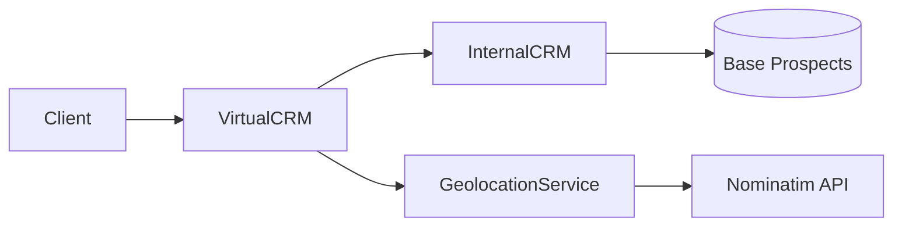

# 🚀 Projet Mashup - Architecture Logicielle Distribuée

<div align="center">


**Projet étudiant d'architecture distribuée avec services REST, géolocalisation et CRM**

[🚀 Démarrage rapide](#-démarrage-rapide) • [� Documentation](#-documentation) • [🏗️ Architecture](#️-architecture) • [🤝 Contribution](#-contribution)

</div>

---

## 📋 Table des Matières

- [🎯 Vue d'ensemble](#-vue-densemble)
- [✨ Fonctionnalités](#-fonctionnalités)
- [🏗️ Architecture](#️-architecture)
- [🚀 Démarrage rapide](#-démarrage-rapide)
- [📦 Modules](#-modules)
- [🧪 Tests et démonstrations](#-tests-et-démonstrations)
- [🔧 Configuration](#-configuration)
- [📖 Documentation](#-documentation)
- [🤝 Contribution](#-contribution)
- [📜 Workflow Git](#-workflow-git)
- [🐛 Dépannage](#-dépannage)
- [📚 Ressources](#-ressources)

## 🎯 Vue d'ensemble

Le **Projet Mashup** est une application distribuée qui combine plusieurs services pour créer un système complet de gestion de prospects commerciaux avec géolocalisation. Ce projet illustre les concepts d'architecture logicielle distribuée en utilisant différents protocoles et technologies.

### 🎨 Concept



## ✨ Fonctionnalités

### 🌍 Géolocalisation
- **Conversion d'adresses** : Transforme "10 rue de la Paix Paris" → coordonnées GPS
- **Service gratuit** : Utilise Nominatim (OpenStreetMap) sans API key
- **Mode hors ligne** : Simulation pour les tests et développement
- **Gestion d'erreurs** : Timeouts, adresses introuvables, problèmes réseau

### 📊 CRM Interne
- **Stockage de prospects** : Informations complètes (nom, entreprise, revenus, région)
- **Recherche avancée** : Par fourchette de revenus, région, période
- **Service Thrift** : API distribuée pour intégration avec d'autres services
- **Thread-safe** : Support multi-clients simultanés

### 🔗 Virtual CRM
- **Agrégation de services** : Combine CRM interne + géolocalisation
- **API REST** : Interface moderne et standardisée
- **Enrichissement automatique** : Ajoute les coordonnées GPS aux prospects

## 🏗️ Architecture

### 📁 Structure du Projet

```
Projet_Mashup/
├── 🌍 geolocation/          # Service de géolocalisation
│   ├── src/main/java/
│   ├── build.gradle
│   └── README.md
├── 📊 internalCRM/          # CRM interne (Thrift)
│   ├── src/main/java/
│   ├── src/main/thrift/
│   ├── gen-java/            # Classes générées
│   ├── build.gradle
│   └── README.md
├── 🔗 virtualCRM/           # CRM virtuel (REST)
│   ├── src/main/java/
│   ├── build.gradle
│   └── README.md
├── 🛠️ gradle/               # Configuration Gradle
├── 📄 build.gradle          # Build principal
├── ⚙️ settings.gradle        # Modules du projet
└── 📖 README.md             # Ce fichier
```

### 🔄 Technologies Utilisées

| Composant | Technologie | Usage |
|-----------|-------------|-------|
| **Build System** | Gradle 8.0+ | Compilation multi-modules |
| **Language** | Java 17+ | Développement principal |
| **Service Distribution** | Apache Thrift | Communication interne CRM |
| **API REST** | Spring Boot / JAX-RS | Interface VirtualCRM |
| **HTTP Client** | Java HttpClient | Appels vers Nominatim |
| **JSON Parsing** | Jackson | Traitement réponses API |
| **Géolocalisation** | Nominatim (OSM) | Service de géocodage gratuit |
| **Logging** | SLF4J Simple | Traces et debugging |

### 📊 Flux de Données

```
1. 📱 Client REST → VirtualCRM
2. 🔗 VirtualCRM → InternalCRM (Thrift) : recherche prospects
3. 🔗 VirtualCRM → Geolocation : conversion adresses → GPS
4. 🌍 Geolocation → Nominatim API : géocodage
5. 📊 Réponse enrichie : prospects + coordonnées GPS
```

## 🚀 Démarrage rapide

### 📋 Prérequis

- **Java 17+** ([Télécharger OpenJDK](https://adoptium.net/))
- **Git** ([Installation](https://git-scm.com/downloads))
- **Connexion internet** (pour Nominatim et dépendances)

### ⚡ Installation Express

```bash
# 1. Cloner le projet
git clone git@github.com:HugoMagret/Projet_Mashup.git
cd Projet_Mashup

# 2. Compilation complète
./gradlew build

# 3. Test rapide - Géolocalisation
./gradlew :geolocation:executerGeoDemo -Padresse="tour eiffel paris"

# 4. Test rapide - CRM Interne
./gradlew :internalCRM:runInternalCRMDemo
```

### 🎯 Première exécution

**Résultats attendus :**

```bash
# Géolocalisation
Adresse='tour eiffel paris' => lat=48.8584 lon=2.2945 nom=Tour Eiffel, Paris, France

# CRM Demo
[DEMO] Prospects trouvés (100k-130k€, Loire-Atlantique) = 1
  -> Martin, Alice
[DEMO] Test terminé avec succès !
```

## 📦 Modules

### 🌍 [Geolocation](./geolocation/README.md)
> Service de géolocalisation basé sur Nominatim

**Démarrage :**
```bash
./gradlew :geolocation:executerGeoDemo -Padresse="2 boulevard de lavoisier angers"
```

**Points clés :**
- ✅ Adresses en français
- ✅ Mode offline pour tests
- ✅ Gestion des timeouts
- ✅ Format JSON standard

### 📊 [InternalCRM](./internalCRM/README.md)
> CRM interne avec service Thrift

**Démarrage serveur :**
```bash
# Terminal 1 : Démarrer le serveur
./gradlew :internalCRM:runInternalCRMServer

# Terminal 2 : Test local
./gradlew :internalCRM:runInternalCRMDemo
```

**Points clés :**
- ✅ Service Thrift sur port 9090
- ✅ Recherche par revenus/région/dates
- ✅ Format spécial "Nom, Prénom"
- ✅ Thread-safe (multi-clients)

**Changements récents (module `internalCRM`) :**

- Ajout de conversions centralisées : `utils/ConverterUtils` (Lead <-> InternalLeadDTO)
- L'implémentation Thrift est maintenant dans `service/InternalServiceImpl` et lance des exceptions Thrift spécifiques pour les validations
- Le projet contient un servlet Thrift (`service/ThriftInternalServiceServlet`) pour exposer le service via HTTP (endpoint `/thrift/internalcrm`)
- Les fichiers de modèle (`model/*`) et les commentaires ont été traduits/clarifiés en français

Voir `internalCRM/README.md` pour la documentation complète et les exemples.

### 🔗 [VirtualCRM](./virtualCRM/README.md)
> API REST unifiée (à implémenter)

**Objectif :**
- Exposer une API REST moderne
- Combiner InternalCRM + Geolocation
- Enrichir les prospects avec coordonnées GPS

## 🧪 Tests et démonstrations

### 🔬 Tests individuels

```bash
# Test géolocalisation (différentes adresses)
./gradlew :geolocation:executerGeoDemo -Padresse="place du commerce nantes"
./gradlew :geolocation:executerGeoDemo -Padresse="notre dame paris"

# Test CRM avec données par défaut
./gradlew :internalCRM:runInternalCRMDemo

# Test serveur CRM (garde le terminal ouvert)
./gradlew :internalCRM:runInternalCRMServer
```

### 📊 Mode offline/simulation

```bash
# Géolocalisation sans internet
GEO_OFFLINE=1 ./gradlew :geolocation:executerGeoDemo

# Ou via propriété système
./gradlew :geolocation:executerGeoDemo -Dgeo.offline=true
```

### ✅ Validation fonctionnelle

| Module | Test | Résultat attendu |
|--------|------|------------------|
| **Geolocation** | Adresse Angers | `lat=47.47, lon=-0.59` |
| **InternalCRM** | Demo locale | `1 prospect trouvé` |
| **Build** | `./gradlew build` | `BUILD SUCCESSFUL` |

## 🔧 Configuration

### ⚙️ Paramètres par défaut

| Service | Paramètre | Valeur | Description |
|---------|-----------|--------|-------------|
| **InternalCRM** | Port Thrift | `9090` | Port d'écoute serveur |
| **Geolocation** | Timeout connexion | `5s` | Délai connexion Nominatim |
| **Geolocation** | Timeout requête | `30s` | Délai réponse maximum |
| **Geolocation** | User-Agent | `ProjetMashup-Etudiant/1.0` | Identification Nominatim |

### 🔧 Personnalisation

```bash
# Port CRM personnalisé
./gradlew :internalCRM:runInternalCRMServer -Pport=8080

# Adresse géolocalisation personnalisée
./gradlew :geolocation:executerGeoDemo -Padresse="VOTRE_ADRESSE"

# Mode debug (verbose)
./gradlew build --info
```

## 📖 Documentation

### 📚 Documentation détaillée

- **[Geolocation README](./geolocation/README.md)** - Service géolocalisation complet
- **[InternalCRM README](./internalCRM/README.md)** - Service CRM Thrift détaillé
- **[Architecture Thrift](./internalCRM/src/main/thrift/internalcrm.thrift)** - Contrat de service

### 🔗 APIs et Contrats

```java
// Géolocalisation
Optional<PointGeographique> geolocaliserAdresse(String adresse)

// CRM Thrift
List<InternalLeadDTO> findLeads(double low, double high, String state)
List<InternalLeadDTO> findLeadsByDate(String from, String to)
long createLead(InternalLeadDTO lead)
void deleteLead(InternalLeadDTO lead)
```

## 🤝 Contribution

### 🌟 Comment contribuer

1. **Fork** le projet sur GitHub
2. **Créer** une branche feature : `git checkout -b feat/ma-fonctionnalite`
3. **Développer** et tester votre code
4. **Commiter** : `git commit -m "feat: ajout de ma fonctionnalité"`
5. **Pousser** : `git push origin feat/ma-fonctionnalite`
6. **Ouvrir** une Pull Request

### 📝 Standards de code

- **Noms en français** : Variables et classes métier
- **Commentaires concrets** : Expliquer le "quoi" et "pourquoi"
- **Tests unitaires** : Pour les nouvelles fonctionnalités
- **Documentation** : Mettre à jour les README correspondants

## 📜 Workflow Git

### 🔄 Bonnes pratiques

```bash
# Préparation
git checkout main
git pull --rebase origin main

# Développement
git checkout -b feat/nom-feature
# ... développement ...
git add .
git commit -m "feat: description claire"

# Synchronisation
git fetch origin
git rebase origin/main  # ou merge si préféré
git push --set-upstream origin feat/nom-feature

# Nettoyage après merge
git checkout main
git pull --rebase origin main
git branch -d feat/nom-feature
```

### 🚀 Commandes utiles

```bash
# État du projet
git status
git log --oneline --graph --decorate

# Sauvegarde temporaire
git stash          # sauvegarder
git stash pop      # récupérer

# Corrections
git commit --amend -m "nouveau message"
git reset --soft HEAD~1  # annuler dernier commit
```

## 🐛 Dépannage

### ❗ Problèmes courants

| Problème | Cause | Solution |
|----------|-------|----------|
| `Connection timed out` | Pas d'internet/Nominatim down | Mode offline : `GEO_OFFLINE=1` |
| `Port already in use` | Serveur CRM déjà démarré | Changer port ou arrêter ancien serveur |
| `Build failed: Java` | Mauvaise version Java | Installer Java 17+ |
| `No such module` | Module non configuré | Vérifier `settings.gradle` |
| `Classes not found` | Build incomplet | `./gradlew clean build` |

### 🔍 Debug et logs

```bash
# Build verbeux
./gradlew build --info --debug

# Logs serveur CRM
./gradlew :internalCRM:runInternalCRMServer --info

# Test réseau géolocalisation
curl "https://nominatim.openstreetmap.org/search?format=json&q=paris"
```

### 💡 Solutions Express

```bash
# Nettoyage complet
./gradlew clean
rm -rf build/ */build/

# Reconstruction complète
./gradlew build --refresh-dependencies

# Test de connectivité
ping nominatim.openstreetmap.org
```

## 📚 Ressources

### 🌐 Documentation officielle

- **[Java 17 Documentation](https://docs.oracle.com/en/java/javase/17/)** - Documentation officielle Java
- **[Gradle User Manual](https://docs.gradle.org/current/userguide/userguide.html)** - Guide Gradle complet
- **[Apache Thrift](https://thrift.apache.org/docs/)** - Documentation Thrift
- **[Nominatim API](https://nominatim.org/release-docs/develop/api/Search/)** - API géolocalisation
- **[Jackson JSON](https://github.com/FasterXML/jackson-docs)** - Traitement JSON

### 🎓 Tutoriels et guides

- **[Git Workflow](https://www.atlassian.com/git/tutorials/comparing-workflows)** - Workflows Git
- **[Java HttpClient](https://openjdk.java.net/groups/net/httpclient/intro.html)** - Client HTTP moderne
- **[Gradle Multi-Project](https://docs.gradle.org/current/userguide/multi_project_builds.html)** - Builds multi-modules

### 🛠️ Outils de développement

- **[Visual Studio Code](https://code.visualstudio.com/)** - Éditeur recommandé
- **[Extension Pack for Java](https://marketplace.visualstudio.com/items?itemName=vscjava.vscode-java-pack)** - Pack Java VS Code
- **[Git Graph](https://marketplace.visualstudio.com/items?itemName=mhutchie.git-graph)** - Visualisation Git
- **[Thunder Client](https://marketplace.visualstudio.com/items?itemName=rangav.vscode-thunder-client)** - Tests API REST

---

<div align="center">

**📧 Questions ? Problèmes ?**

[🐛 Signaler un bug](https://github.com/HugoMagret/Projet_Mashup/issues) • [💡 Demander une fonctionnalité](https://github.com/HugoMagret/Projet_Mashup/issues) • [📖 Améliorer la doc](https://github.com/HugoMagret/Projet_Mashup/pulls)

**Fait avec ❤️ dans le cadre du cours d'Architecture Logicielle Distribuée**

</div>

git checkout main
git fetch origin
git pull --rebase origin main


Créer une branche pour l'issue / feature :

git checkout -b feat/nom-court
# ou
git switch -c feat/nom-court


Travailler, vérifier les changements, préparer le commit :

git status
git add fichier1 fichier2         # ou: git add .
git commit -m "Courte description : ce qui a été fait"


Pousser la branche distante (une seule fois pour relier local <-> remote) :

git push --set-upstream origin feat/nom-court
# ensuite, simplement :
git push


Ouvrir une Pull Request / Merge Request via l’interface GitHub.

🔁 Mettre à jour une branche feature avec main

Option propre (rebase) — historique linéaire :

git fetch origin
git rebase origin/main
# résoudre conflits si nécessaire, puis:
git rebase --continue


Option simple (merge) — commit de merge :

git fetch origin
git merge origin/main
# résoudre conflits, commit si requis

🔧 Résolution de conflits (cas courant)

Git signale les conflits après merge ou rebase.

Éditer les fichiers conflictuels, garder la version souhaitée.

Marquer comme résolu :

git add fichier_conflit
# si rebase :
git rebase --continue
# si merge :
git commit    # si git n'a pas créé automatiquement le commit de merge


Pour annuler un rebase en cours :

git rebase --abort

⚠️ Forcer un push (utiliser avec prudence)

N’écrasez le remote que si vous savez ce que vous faites.
Préférer --force-with-lease à --force :

git push --force-with-lease

🗂 Supprimer une branche
# supprimer localement
git branch -d feat/nom-court    # refuse si non mergée
git branch -D feat/nom-court    # force la suppression

# supprimer sur remote
git push origin --delete feat/nom-court

🧰 Commandes utiles (rappel rapide)
git fetch origin                              # récupérer les refs distantes
git pull --rebase                             # pull + rebase (évite commits de merge)
git status                                    # état du working tree
git diff                                      # voir les différences non-stagées
git add -p                                    # ajouter par hunks
git commit --amend -m "nouveau message"       # modifier dernier commit (local)
git log --oneline --graph --decorate --all    # historique compact
git stash                                     # sauvegarder temporairement les changements
git stash pop                                 # réappliquer le stash
git reset --soft HEAD~1                        # retirer le dernier commit, garder changements
git reset --hard HEAD                          # rétablir l'état exact du HEAD (perdre modifications locales)
git cherry-pick <commit>                       # appliquer un commit précis sur la branche courante

🔒 Bonnes pratiques

Faire des commits atomiques et messages explicites.

Travailler sur des branches nommées clairement (feat/, fix/, chore/).

Mettre à jour main avant de démarrer une feature (git pull --rebase).

Préférer rebase pour garder un historique lisible, utiliser merge si tu veux conserver le contexte de merge.

Ne pas forcer le push sur une branche partagée sans prévenir l’équipe.

Utiliser --force-with-lease si un force est nécessaire.

🧾 Exemple complet — cycle typique
# cloner
git clone git@github.com:HugoMagret/Projet_Mashup.git
cd Projet_Mashup

# préparer le travail
git checkout main
git pull --rebase origin main

# créer la branche
git checkout -b feat/ajout-auth

# coder, vérifier, committer
git status
git add .
git commit -m "feat(auth): ajout login via token"

# mettre à jour depuis main si besoin
git fetch origin
git rebase origin/main

# pousser et ouvrir PR
git push --set-upstream origin feat/ajout-auth
